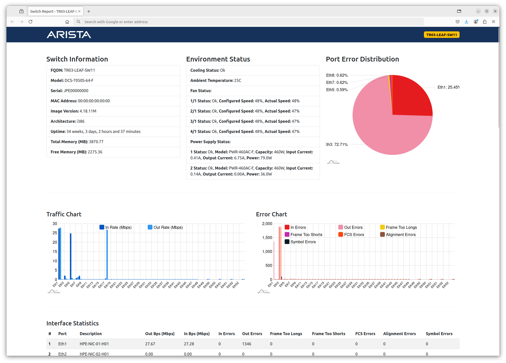

# Arista Switch Report Tool


**Arista SRT** (Switch Report Tool) is a vital utility designed for Network Administrators managing Arista switches. This tool provides quick access to essential switch information, all presented in a user-friendly HTML format.

<br><br>
## 🌟 Features

- **Switch Information and Environment Status**: Easily summarizes critical switch data for efficient monitoring.
- **Traffic and Error Charts**: Displays interactive charts using amCharts, allowing users to zoom in and navigate through interface data.
- **Interface Statistics**: Generates a comprehensive table of interface statistics and error counts.

<br><br>
## 🚀 What's next?
The next release will focus on Netmiko to simplify SSH management and execute operations such as configuration backups and more. Stay tuned!

<br><br>
## Installation Guide

### Required Packages and Dependencies
- **Python**: Version 3.x
- **pip**: Python package manager

### Required Python Libraries
- `json`
- `requests`
- `datetime`
- `re`

<br><br>
## 🎬 Getting Started

**Step 1: Add Your eAPI Credentials**  
Navigate to the "Source Code" directory and run the script using the following command:

```bash
python3 arista-srt.py
```
An HTML report file will be created in the same directory.

<br><br>
## Tested On

This script has been successfully tested with the **DCS-7050S-64-F** model.

<br><br>
## 👐 Contributing

This project is a community-driven initiative. If you find it helpful, please consider starring it, forking it, or contributing in any way you can. Every piece of feedback, reported issue, or pull request is a valuable opportunity to enhance this tool.

*P.S.*  
This project is not intended to replicate or clone Arista Cloud Vision. Instead, my goal is to provide a simple and effective tool to streamline and accelerate operations.

<br><br>
## 💖 Acknowledgments

Special thanks to **Arista Networks Inc.** for offering a robust EOS API (eAPI). You can find more information [here](https://arista.my.site.com/AristaCommunity/s/article/arista-eapi-101).

A heartfelt thank you to the Open-Source Community for the invaluable libraries that contribute to this project.